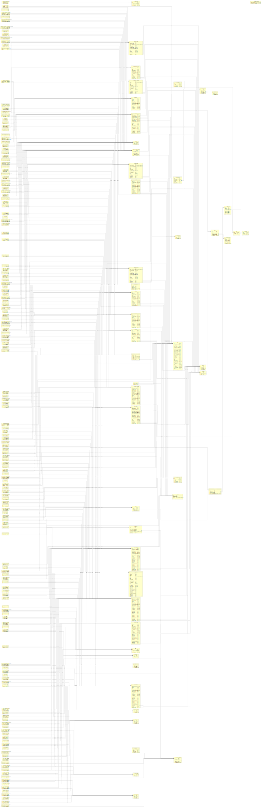

## Database Schematics

Database created by _EntityFrameworkCore_ (6.0.X) migration of posgreSQL DAtabase. **using class Relationship and no context options**. EF Core created migration using relationships in the Entities layer. I used DataAnnotaion at first, but when I removed it, it removed some properties, kept the IDs. 

### Attention; schema files (PNG) are high-resolution
### Attention; Very White

 
 
 
 
 

#### [Hierarchical Schematic By svg](LRMS_DataBase_Schematic_Hierarchical.svg)
#### [Hierarchical Schematic By png](LRMS_DataBase_Schematic_Hierarchical.png)

 

 
 
 

#### [Orthogonal Schematic By svg](LRMS_DataBase_Schematic_Orthogonal.svg)
#### [Orthogonal Schematic By png](LRMS_DataBase_Schematic_Orthogonal.png)

 

